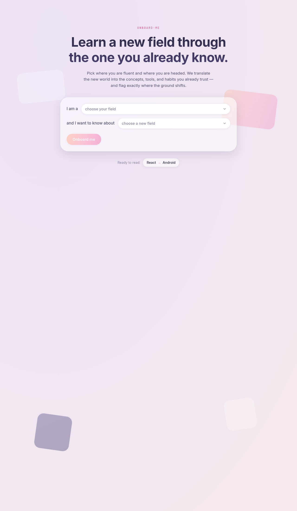
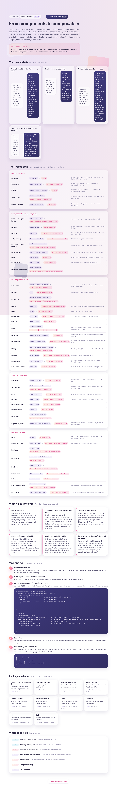

# onboard-me

**Learn a new field through the one you already know.**

You're a senior React developer. You know the npm world, React's release history, building UI with Material UI, a Node or Nest backend, Docker to ship it. Then you decide to learn native Android with Kotlin, and you're standing at the edge of a forest. Is there an npm here? How do I do UI? How does building work? Are there community packages, and how do I find them? What do I watch out for? You can't tell which of your instincts transfer and which will quietly mislead you.

onboard-me answers that. You pick the field you're fluent in and the one you're heading into:

> I am a **React Developer** and I want to know about **Android Development**.

It then explains the new world in the vocabulary of the old one. It maps concept to concept and flags what transfers cleanly and where the ground actually shifts, so you get oriented in an afternoon instead of a month.



## The idea

Most learning resources start from zero. That's the wrong altitude for someone who already ships software. They don't need "what is a variable", they need "what is `npm` *here*, and what's the catch." Expertise transfers when you can anchor the unknown to something you already trust.

Every guide is a translation rather than a tutorial. The home turf (X) is the dictionary; the target field (Y) is the text being translated. The same person, the same instincts, a new syntax.

## What a guide contains

Each guide follows one template, tuned to how an experienced developer onboards:

- **The mental shifts**: the handful of big-picture reframings, not tool swaps. (e.g. *a lifecycle instead of a page load*; *compiled and typed, not shipped as source*.)
- **The Rosetta table**: the dense, scannable core. Grouped rows of "what you do today → what it becomes over there," with a one-line nuance each. `npm / pnpm + Vite → Gradle`. `useState → remember { mutableStateOf() }`. `React Router → Navigation Compose`.
- **What will surprise you**: the culture shocks worth bracing for, where leaning on a transferred instinct will burn you. (e.g. *Gradle is not Vite*; *rotating the screen recreates your UI*.)
- **Your first run**: install to a running app, with the first code sample annotated against its React equivalent line by line.
- **Packages to know**: the libraries you'll reach for first, each tagged with its closest analog in the field you came from.
- **Where to go next**: a short, curated set of canonical docs, courses, and sample apps. No link farm.



The flagship guide, **React → Android**, is written end to end and ships in this repo. It is the worked example the rest of the product is modeled on.

## How it's built

- **React 19**, written for the React Compiler era. No hand-rolled `useMemo`/`useCallback`.
- **TypeScript** in strict mode, with a single content model (`Guide`) that the UI renders. The renderer knows nothing about React or Android; it renders the shape. Add a field, add a guide, and the components don't change.
- **[Base UI](https://base-ui.com)** for the interactive primitives (the field `Select`). Base UI ships behavior and accessibility unstyled, which is exactly right here: the glass-and-gradient look is ours, the keyboard handling and focus management are theirs.
- **Vite 8** for the dev loop and build.
- **Hash-based deep links**: every guide has a shareable URL (`/#/react/android`), and the browser back button works.

### The content model

Everything renders from `src/data/types.ts`:

```ts
interface Guide {
  source: FieldId;
  target: FieldId;
  headline: string;        // "From components to composables"
  goodNews: string;        // the one reassuring sentence
  mentalShifts: MentalShift[];
  rosetta: RosettaGroup[];
  gotchas: Gotcha[];
  firstRun: FirstStep[];
  packagesToKnow: KnownPackage[];
  resources: Resource[];
}
```

A curated guide is a hand-written `Guide` object (see `src/data/guides/react-to-android.ts`). The registry in `src/data/guides/index.ts` maps `source__target` to a guide.

### Curated now, generated later

There are more field pairs than anyone can hand-write. Twelve fields already make 132 directed pairs. The model is built for that:

- **Curated guides** are authored objects. High quality, slow to produce. Used for the popular pairs.
- **Generated guides** fill the long tail. A backend prompts an LLM to return the *same* `Guide` JSON, validated against the schema and rendered by the exact same components. The structure is the quality floor: a generated guide can't ramble, because it has to fill a Rosetta table and a first-run walkthrough or it fails validation.
- **Promotion**: good generated guides get reviewed, edited, and frozen into curated ones. The catalog improves where usage is highest.

The seam already exists. Pick a pair without a curated guide and you land on `GuideMissing`, which is where a generated guide would stream in. It stays honest about what exists today rather than faking content.

## Project structure

```
src/
  data/
    types.ts                 # the Guide content model
    fields.ts                # selectable fields + Base UI item map
    guides/
      react-to-android.ts    # the flagship curated guide
      index.ts               # pair registry + lookup
  components/
    FieldSelect.tsx          # styled Base UI Select
    Landing.tsx              # the two-select opener
    GuideView.tsx            # renders a Guide
    GuideMissing.tsx         # not-yet-curated state (generation seam)
  styles/
    tokens.css               # design tokens sampled from the reference art
    global.css               # base + glass surface
    components.css           # everything visual
  App.tsx                    # hash routing + view switch
  main.tsx
docs/                        # screenshots used in this README
```

## Getting started

Requires Node 20+.

```bash
npm install
npm run dev        # http://localhost:5173
```

```bash
npm run build      # typecheck (tsc -b) + production build
npm run preview    # serve the build
npm run typecheck  # types only
```

## Adding a curated guide

1. Make sure both fields exist in `src/data/fields.ts` (add them if not).
2. Copy `src/data/guides/react-to-android.ts` and fill in the sections for your pair. Write every row from the source field's point of view. The reader is fluent there.
3. Register it in `src/data/guides/index.ts`.

It now appears as a "ready to read" chip on the landing page and resolves at `/#/<source>/<target>`.

## Design

The palette is sampled from the reference dashboard art: a soft lavender field, a peach-to-magenta warm gradient for primary accents, and deep indigo glass panels. Every color lives in `src/styles/tokens.css` and is referenced by token, with no literals scattered through components, so the whole theme retunes from one file. The target field renders on the dark indigo surface and the source field on light glass, so "where you are" and "where you're going" read at a glance.

## Roadmap

Open directions, roughly in priority order:

- **Generation backend** for arbitrary pairs, with the schema as the contract and generated results cached so a pair is only built once.
- **Trust signals** on generated content: provenance, a "was this accurate?" vote, and a path to promote good ones to curated.
- **Swap direction** in place (turn the arrow into a button). *Android → React* is a different guide, not a reversed one.
- **Depth levels**: a 5-minute orientation vs. a deep dive from the same data.
- **Inline term expansion**: hover any target-field term for a one-line gloss.
- **Usage-driven curation**: track which pairs people actually pick and curate those first.
- **Community guides**: the `Guide` shape is small enough to accept as pull requests.
